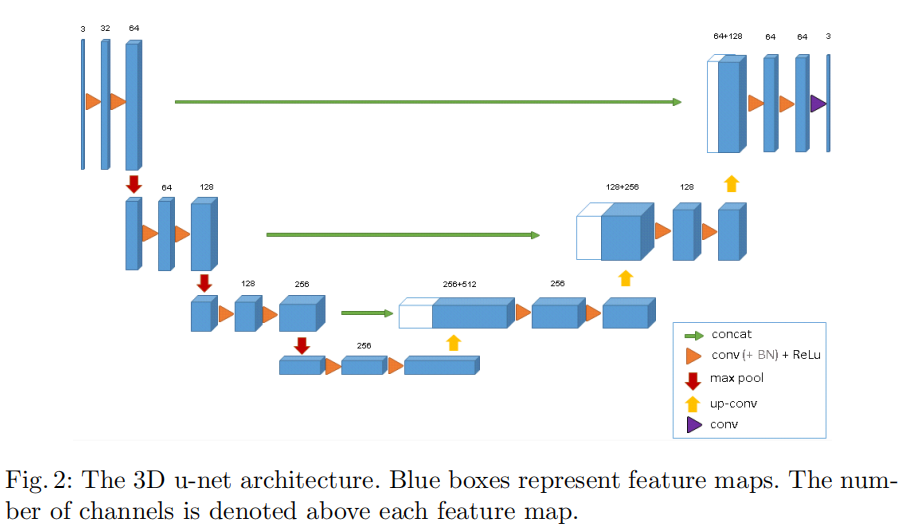

# Unet3D
implement Unet3D for segmentation

-  Todo
- [x] 实现基于Pytorch的Unet3D;
- [x] 实现数据加载功能；
- [x] 训练参数通过类包装；
- [ ] 训练过程中保存训练集和测试集评价指标高的模型；
- [ ] 实现断点继续训练功能；
- [ ] 实现训练可视化功能；
- [ ] 实现模型转换功能；
- [ ] 实现模型评价功能；
- [ ] 实现各种小tricks；
- [ ] 切换CPU与GPU，并可以设置单卡与多卡；
- [ ] 设置权重初始化方式；
- [ ] 

