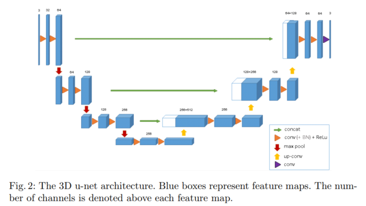

# Unet3D实现


## 论文


论文《3D U-Net: Learning Dense Volumetric Segmentation from Sparse Annotation  》

| 论文   | 3D U-Net: Learning Dense Volumetric Segmentation from Sparse Annotation（3D U-Net:学习密集体积稀疏标注分割） |
| ------ | ------------------------------------------------------------ |
| 作者   | ¨ 1;2, Ahmed Abdulkadir1;4, Soeren S. Lienkamp2;3, Thomas<br/>Brox1;2, and Olaf Ronneberger1;2;5 |
| 单位   | 1 Computer Science Department, University of Freiburg, Germany<br/>2 BIOSS Centre for Biological Signalling Studies, Freiburg, Germany<br/>3 University Hospital Freiburg, Renal Division, Faculty of Medicine, University of<br/>Freiburg, Germany<br/>4 Department of Psychiatry and Psychotherapy, University Medical Center Freiburg,<br/>Germany<br/>5 Google DeepMind, London, UK<br/>cicek@cs.uni-freiburg.de |
| 简介   | 本文介绍了一种从稀疏标注的体积图像中学习的体积分割网络。我们概述了该方法的两个有吸引力的用例:(1)在半自动设置中，用户在待分割的数据中标注一些切片。网络从这些稀疏注释中学习，并提供密集的3D分割。(2)在全自动设置中，我们假设存在一个有代表性的、稀疏注释的训练集。在此数据集上训练，网络密集分割新的体积图像。该网络扩展了Ronneberger等人提出的u-net架构，将所有2D操作替换为3D操作。该实现在训练期间执行动态弹性变形以实现有效的数据增强。它是从头开始端到端训练的，也就是说，不需要预先训练的网络。我们在复杂的、高度可变的3D结构——爪蟾肾脏上测试了所提出方法的性能，并在两种用例中都取得了良好的结果。 |
| 关键词 | 卷积神经网络，3D，生物医学图像分割，非洲爪蟾肾脏，半自动，全自动， |
| 代码   | https://lmb.informatik.uni-freiburg.de/resources/opensource/unet.en.html   基于caffe实现。 |


该网络基于之前的u-net架构，由一个收缩的编码器部分分析整个图像和一个连续扩展的解码器部分产生全分辨率分割[11]。u-net完全是二维结构，本文提出的网络以三维体为输入，并对其进行相应的三维操作，具体如下: 3D卷积、3D最大池化和3D上卷积层。此外，我们避免了网络架构中的瓶颈，并使用了批处理规范化以便更快的收敛。


图2说明了网络体系结构。像标准的u-net一样，它有一个编码路径和一个解码路径，每个路径都有四个分辨率级别。

- 在编码路径中，每层包含两个3 × 3 × 3的卷积，每个卷积后面都有一个整流线性单元(ReLu)，然后是一个2 × 2 × 2的最大池化，每个维度的步长为2。
- 在解码路径中，每一层由一个2 × 2 × 2的上卷积组成，每个维度的步长为2，然后是两个3 × 3 × 3的卷积，每个卷积后面都有一个ReLu。
- 从编码路径中相同分辨率层向解码路径的快捷连接提供了基本的高分辨率特性。

在最后一层,1×1×1卷积将输出通道的数量减少到在我们情况下的标签的数量。该体系结构共有19069955个参数。就像在[13]中建议的那样，我们通过在最大池化之前将已经存在的通道数加倍来避免瓶颈。我们在合成路径中也采用了这种方案。


该架构的重要部分是加权softmax损失函数，它允许我们在稀疏注释上进行训练。将未标记像素的权重设置为零，可以只从标记的像素中学习，因此可以推广到整个体积。





## 代码实现


### 配置文件

配置文件一般配置模型结构，配置训练集、测试集数据路径、配置保存模型路径、配置log文件输出路径。


### 数据加载


DataLoader


### 网络参数

model.parameters() 与model.state_dict()，前者多见于optim初始化，后者多见于模型的保存

```python
optimizer = torch.optim.Adam(model.parameters(), lr=1e-5)
torch.save(model.state_dict(), "bets_model.pth")
```

对于生成器，需要使用循环或者next()来获取数据。


### tricks

断点继续训练；

训练可视化；

focal loss；

支持多显卡；

数据可视化；


参考：

[3D-UNet的Pytorch实现_pytorch切patch_pawerd的博客-CSDN博客](https://blog.csdn.net/weixin_45185432/article/details/110851198)

[Unet.py · master · mirrors / panxiaobai / lits_pytorch · GitCode](https://gitcode.net/mirrors/panxiaobai/lits_pytorch/-/blob/master/Unet.py)

[UNet-3D个人理解及代码实现（PyTorch）_3d unet_10000hours的博客-CSDN博客](https://blog.csdn.net/qq_45800517/article/details/124008135)

[GitHub推荐\]PyTorch-3D-UNet - 知乎 (zhihu.com)](https://zhuanlan.zhihu.com/p/396755931)

[3DUNet的Pytorch实现 - 知乎 (zhihu.com)](https://zhuanlan.zhihu.com/p/113318562)


[3D U-Net：语义分割 - 知乎 (zhihu.com)](https://zhuanlan.zhihu.com/p/547476611) 各种小知识


   
