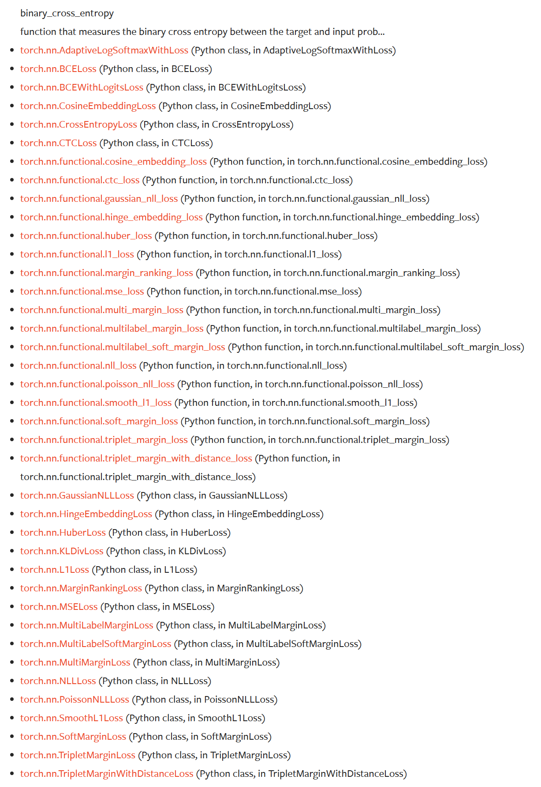
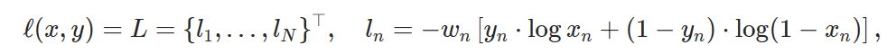

# 函数与包说明


## pyth系统操作库 os


获取指定路径指定后缀的文件

```python
import os

def get_files(path, suffix):
    return [os.path.join(root, file) for root, dirs, files in os.walk(path) for file in files if file.endswith(suffix)]
```

获取指定路径下，指定后缀名的文件。

- `for file in files if file.endswith(suffix)` 是过滤`os.walk(path)` 的三个返回值中的`files` ，保留指定后缀的文件。
- 变量path最先传入`os.walk()` 则先返回`root, dirs, files` ；
- 对`for file in files if file.endswith(suffix)` 进行过滤，提取到只包含指定后缀的文件file，然后根据`os.path.join(root, file)` 进行路径拼接，得到文件的全路径。

### os.path.join()


```python
os.path.join(root, file) # 用于路径拼接
```


### os.walk()


```python
os.walk(top, topdown=True, onerror=None, followlinks=False)
```

参数：

- top:需要遍历目录的地址。
- topdown 为真，则优先遍历top目录，否则优先遍历top的子目录(默认为开启)。
- onerror 需要一个 callable 对象，当walk需要异常时，会调用。
- followlinks 如果为真，则会遍历目录下的快捷方式(linux 下是 symbolic link)实际所指的目录(默认关闭)。
  

以上四个参数一般只需要指定第一个文件夹路径，剩下的一般情况不需要指定。

os.walk使用
os.walk 的返回值是一个生成器(generator),也就是说我们需要用循环不断的遍历它（不可以直接print），来获得所有的内容。

每次遍历的对象都是返回的是一个三元元组(root,dirs,files)

- root 所指的是当前正在遍历的这个文件夹的本身的地址
- dirs 是一个 list ，内容是该文件夹中所有的目录的名字(不包括子目录)
- files 同样是 list , 内容是该文件夹中所有的文件(不包括子目录)
  

参考：[Python中os.walk函数的用法（遍历文件夹下文件并获得路径）_os walk_hairenvsgebaini的博客-CSDN博客](https://blog.csdn.net/qq_41562433/article/details/82995098)


## python时间库time


```python
import time

 t = time.strftime("%m%d%H%M%S", time.localtime())
```


### time.**strftime**(*format*[, *t*])

转换一个元组或 [`struct_time`](https://docs.python.org/zh-cn/3/library/time.html#time.struct_time) 表示的由 [`gmtime()`](https://docs.python.org/zh-cn/3/library/time.html#time.gmtime) 或 [`localtime()`](https://docs.python.org/zh-cn/3/library/time.html#time.localtime) 返回的时间到由 *format* 参数指定的字符串。如果未提供 *t* ，则使用由 [`localtime()`](https://docs.python.org/zh-cn/3/library/time.html#time.localtime) 返回的当前时间。 *format* 必须是一个字符串。如果 *t* 中的任何字段超出允许范围，则引发 [`ValueError`](https://docs.python.org/zh-cn/3/library/exceptions.html#ValueError) 。

0是时间元组中任何位置的合法参数；如果它通常是非法的，则该值被强制改为正确的值。

以下指令可以嵌入 *format* 字符串中。它们显示时没有可选的字段宽度和精度规范，并被 [`strftime()`](https://docs.python.org/zh-cn/3/library/time.html#time.strftime) 结果中的指示字符替换：

| 指令 | 含意                                                         | 备注 |
| :--- | :----------------------------------------------------------- | :--- |
| `%a` | 本地化的缩写星期中每日的名称。                               |      |
| `%A` | 本地化的星期中每日的完整名称。                               |      |
| `%b` | 本地化的月缩写名称。                                         |      |
| `%B` | 本地化的月完整名称。                                         |      |
| `%c` | 本地化的适当日期和时间表示。                                 |      |
| `%d` | 十进制数 [01,31] 表示的月中日。                              |      |
| `%H` | 十进制数 [00,23] 表示的小时（24小时制）。                    |      |
| `%I` | 十进制数 [01,12] 表示的小时（12小时制）。                    |      |
| `%j` | 十进制数 [001,366] 表示的年中日。                            |      |
| `%m` | 十进制数 [01,12] 表示的月。                                  |      |
| `%M` | 十进制数 [00,59] 表示的分钟。                                |      |
| `%p` | 本地化的 AM 或 PM 。                                         | (1)  |
| `%S` | 十进制数 [00,61] 表示的秒。                                  | (2)  |
| `%U` | 十进制数 [00,53] 表示的一年中的周数（星期日作为一周的第一天）。 在第一个星期日之前的新年中的所有日子都被认为是在第 0 周。 | (3)  |
| `%w` | 十进制数 [0(星期日),6] 表示的周中日。                        |      |
| `%W` | 十进制数 [00,53] 表示的一年中的周数（星期一作为一周的第一天）。 在第一个星期一之前的新年中的所有日子被认为是在第 0 周。 | (3)  |
| `%x` | 本地化的适当日期表示。                                       |      |
| `%X` | 本地化的适当时间表示。                                       |      |
| `%y` | 十进制数 [00,99] 表示的没有世纪的年份。                      |      |
| `%Y` | 十进制数表示的带世纪的年份。                                 |      |
| `%z` | 时区偏移以格式 +HHMM 或 -HHMM 形式的 UTC/GMT 的正或负时差指示，其中H表示十进制小时数字，M表示小数分钟数字 [-23:59, +23:59] 。[1](https://docs.python.org/zh-cn/3/library/time.html#id4) |      |
| `%Z` | 时区名称（如果不存在时区，则不包含字符）。已弃用。 [1](https://docs.python.org/zh-cn/3/library/time.html#id4) |      |
| `%%` | 字面的 `'%'` 字符。                                          |      |

注释：

1. 当与 [`strptime()`](https://docs.python.org/zh-cn/3/library/time.html#time.strptime) 函数一起使用时，如果使用 `%I` 指令来解析小时， `%p` 指令只影响输出小时字段。
2. 范围真的是 `0` 到 `61` ；值 `60` 在表示 [leap seconds](https://en.wikipedia.org/wiki/Leap_second) 的时间戳中有效，并且由于历史原因支持值 `61` 。
3. 当与 [`strptime()`](https://docs.python.org/zh-cn/3/library/time.html#time.strptime) 函数一起使用时， `%U` 和 `%W` 仅用于指定星期几和年份的计算。

下面是一个示例，一个与 [**RFC 2822**](https://datatracker.ietf.org/doc/html/rfc2822.html) Internet电子邮件标准以兼容的日期格式。 [1](https://docs.python.org/zh-cn/3/library/time.html#id4)

```python
>>> from time import gmtime, strftime
>>> strftime("%a, %d %b %Y %H:%M:%S +0000", gmtime())
'Thu, 28 Jun 2001 14:17:15 +0000'
```

某些平台可能支持其他指令，但只有此处列出的指令具有 ANSI C 标准化的含义。要查看平台支持的完整格式代码集，请参阅 *[strftime(3)](https://manpages.debian.org/strftime(3))* 文档。

在某些平台上，可选的字段宽度和精度规范可以按照以下顺序紧跟在指令的初始 `'%'` 之后；这也不可移植。字段宽度通常为2，除了 `%j` ，它是3。


参考：[time --- 时间的访问和转换 — Python 3.11.4 文档](https://docs.python.org/zh-cn/3/library/time.html)


## python 进度条库tqdm


```python
# -*- coding : UTF-8 -*-
# @file   : func_test.py
# @Time   : 2023-06-17 21:32
# @Author : wmz

import time
from tqdm import tqdm, trange

if __name__ == '__main__':
    # trange(i) 是tqdm(range(i))的一种简单写法
    for i in trange(100):
        time.sleep(0.05)

    for i in tqdm(range(100), desc='Processing'):
        time.sleep(0.05)

    dic = ['a', 'b', 'c', 'd', 'e']
    pbar = tqdm(dic)
    for i in pbar:
        pbar.set_description('Processing' + i)
        time.sleep(0.2)
```

函数解释

```python
class tqdm():
  """
  Decorate an iterable object, returning an iterator which acts exactly
  like the original iterable, but prints a dynamically updating
  progressbar every time a value is requested.
  """

  def __init__(self, iterable=None, desc=None, total=None, leave=True,
               file=None, ncols=None, mininterval=0.1,
               maxinterval=10.0, miniters=None, ascii=None, disable=False,
               unit='it', unit_scale=False, dynamic_ncols=False,
               smoothing=0.3, bar_format=None, initial=0, position=None,
               postfix=None, unit_divisor=1000):
```

[Parameters](https://github.com/tqdm/tqdm#table-of-contents)

- - iterable : iterable, optional

    Iterable to decorate with a progressbar. Leave blank to manually manage the updates.

- - desc : str, optional

    Prefix for the progressbar.

- - total : int or float, optional

    The number of expected iterations. If unspecified, len(iterable) is used if possible. If float("inf") or as a last resort, only basic progress statistics are displayed (no ETA, no progressbar). If `gui` is True and this parameter needs subsequent updating, specify an initial arbitrary large positive number, e.g. 9e9.

- - leave : bool, optional

    If [default: True], keeps all traces of the progressbar upon termination of iteration. If `None`, will leave only if `position` is `0`.

- - file : `io.TextIOWrapper` or `io.StringIO`, optional

    Specifies where to output the progress messages (default: sys.stderr). Uses `file.write(str)` and `file.flush()` methods. For encoding, see `write_bytes`.

- - ncols : int, optional

    The width of the entire output message. If specified, dynamically resizes the progressbar to stay within this bound. If unspecified, attempts to use environment width. The fallback is a meter width of 10 and no limit for the counter and statistics. If 0, will not print any meter (only stats).

- - mininterval : float, optional

    Minimum progress display update interval [default: 0.1] seconds.

- - maxinterval : float, optional

    Maximum progress display update interval [default: 10] seconds. Automatically adjusts `miniters` to correspond to `mininterval` after long display update lag. Only works if `dynamic_miniters` or monitor thread is enabled.

- - miniters : int or float, optional

    Minimum progress display update interval, in iterations. If 0 and `dynamic_miniters`, will automatically adjust to equal `mininterval` (more CPU efficient, good for tight loops). If > 0, will skip display of specified number of iterations. Tweak this and `mininterval` to get very efficient loops. If your progress is erratic with both fast and slow iterations (network, skipping items, etc) you should set miniters=1.

- - ascii : bool or str, optional

    If unspecified or False, use unicode (smooth blocks) to fill the meter. The fallback is to use ASCII characters " 123456789#".

- - disable : bool, optional

    Whether to disable the entire progressbar wrapper [default: False]. If set to None, disable on non-TTY.

- - unit : str, optional

    String that will be used to define the unit of each iteration [default: it].

- - unit_scale : bool or int or float, optional

    If 1 or True, the number of iterations will be reduced/scaled automatically and a metric prefix following the International System of Units standard will be added (kilo, mega, etc.) [default: False]. If any other non-zero number, will scale `total` and `n`.

- - dynamic_ncols : bool, optional

    If set, constantly alters `ncols` and `nrows` to the environment (allowing for window resizes) [default: False].

- - smoothing : float, optional

    Exponential moving average smoothing factor for speed estimates (ignored in GUI mode). Ranges from 0 (average speed) to 1 (current/instantaneous speed) [default: 0.3].

- - bar_format : str, optional

    Specify a custom bar string formatting. May impact performance. [default: '{l_bar}{bar}{r_bar}'], where l_bar='{desc}: {percentage:3.0f}%|' and r_bar='| {n_fmt}/{total_fmt} [{elapsed}<{remaining}, ' '{rate_fmt}{postfix}]' Possible vars: l_bar, bar, r_bar, n, n_fmt, total, total_fmt, percentage, elapsed, elapsed_s, ncols, nrows, desc, unit, rate, rate_fmt, rate_noinv, rate_noinv_fmt, rate_inv, rate_inv_fmt, postfix, unit_divisor, remaining, remaining_s, eta. Note that a trailing ": " is automatically removed after {desc} if the latter is empty.

- - initial : int or float, optional

    The initial counter value. Useful when restarting a progress bar [default: 0]. If using float, consider specifying `{n:.3f}` or similar in `bar_format`, or specifying `unit_scale`.

- - position : int, optional

    Specify the line offset to print this bar (starting from 0) Automatic if unspecified. Useful to manage multiple bars at once (eg, from threads).

- - postfix : dict or `*`, optional

    Specify additional stats to display at the end of the bar. Calls `set_postfix(**postfix)` if possible (dict).

- - unit_divisor : float, optional

    [default: 1000], ignored unless `unit_scale` is True.

- - write_bytes : bool, optional

    Whether to write bytes. If (default: False) will write unicode.

- - lock_args : tuple, optional

    Passed to `refresh` for intermediate output (initialisation, iterating, and updating).

- - nrows : int, optional

    The screen height. If specified, hides nested bars outside this bound. If unspecified, attempts to use environment height. The fallback is 20.

- - colour : str, optional

    Bar colour (e.g. 'green', '#00ff00').

- - delay : float, optional

    Don't display until [default: 0] seconds have elapsed.

    

参考：[tqdm/tqdm: A Fast, Extensible Progress Bar for Python and CLI (github.com)](https://github.com/tqdm/tqdm)


## python日志模块 logging

很多的小伙伴在平时写代码的时候，基本上使用的都是使用print()函数来进行一些日志的打印，使用print()来进行一些代码的调试，在较小的程序中这样做是可以的。但是在实际的工程项目中，我们需要保存程序运行的日志，以排查程序在某一个时候崩溃的具体原因，以便及时**定位Bug**进行抢救，而在Python中，**logging**就可以十分灵活的帮助我们记录程序运行的过程的中的一些信息。

**那么日志的作用是什么呢？**

归纳起来日志的作用有三点：

- 进行程序(代码)的调试
- 程序运行过程中的问题定位和分析
- 收集程序运行的情况

### 日志常用指引

**日志基础教程**

日志是对软件执行时所发生事件的一种追踪方式。软件开发人员对他们的代码添加日志调用，借此来指示某事件的发生。一个事件通过一些包含变量数据的描述信息来描述（比如：每个事件发生时的数据都是不同的）。开发者还会区分事件的重要性，重要性也被称为 *等级* 或 *严重性*。

#### 什么时候使用日志

对于简单的日志使用来说日志功能提供了一系列便利的函数。它们是 [`debug()`](https://docs.python.org/zh-cn/3/library/logging.html#logging.debug)，[`info()`](https://docs.python.org/zh-cn/3/library/logging.html#logging.info)，[`warning()`](https://docs.python.org/zh-cn/3/library/logging.html#logging.warning)，[`error()`](https://docs.python.org/zh-cn/3/library/logging.html#logging.error) 和 [`critical()`](https://docs.python.org/zh-cn/3/library/logging.html#logging.critical)。想要决定何时使用日志，请看下表，其中显示了对于每个通用任务集合来说最好的工具。

| 你想要执行的任务                                             | 此任务最好的工具                                             |
| :----------------------------------------------------------- | :----------------------------------------------------------- |
| 对于命令行或程序的应用，结果显示在控制台。                   | [`print()`](https://docs.python.org/zh-cn/3/library/functions.html#print) |
| 在对程序的普通操作发生时提交事件报告(比如：状态监控和错误调查) | [`logging.info()`](https://docs.python.org/zh-cn/3/library/logging.html#logging.info) 函数(当有诊断目的需要详细输出信息时使用 [`logging.debug()`](https://docs.python.org/zh-cn/3/library/logging.html#logging.debug) 函数) |
| 提出一个警告信息基于一个特殊的运行时事件                     | [`warnings.warn()`](https://docs.python.org/zh-cn/3/library/warnings.html#warnings.warn) 位于代码库中，该事件是可以避免的，需要修改客户端应用以消除告警[`logging.warning()`](https://docs.python.org/zh-cn/3/library/logging.html#logging.warning) 不需要修改客户端应用，但是该事件还是需要引起关注 |
| 对一个特殊的运行时事件报告错误                               | 引发异常                                                     |
| 报告错误而不引发异常(如在长时间运行中的服务端进程的错误处理) | [`logging.error()`](https://docs.python.org/zh-cn/3/library/logging.html#logging.error), [`logging.exception()`](https://docs.python.org/zh-cn/3/library/logging.html#logging.exception) 或 [`logging.critical()`](https://docs.python.org/zh-cn/3/library/logging.html#logging.critical) 分别适用于特定的错误及应用领域 |

日志功能应以所追踪事件级别或严重性而定。各级别适用性如下（以严重性递增）：

| 级别       | 何时使用                                                     |
| :--------- | :----------------------------------------------------------- |
| `DEBUG`    | 细节信息，仅当诊断问题时适用。                               |
| `INFO`     | 确认程序按预期运行。                                         |
| `WARNING`  | 表明有已经或即将发生的意外（例如：磁盘空间不足）。程序仍按预期进行。 |
| `ERROR`    | 由于严重的问题，程序的某些功能已经不能正常执行               |
| `CRITICAL` | 严重的错误，表明程序已不能继续执行                           |

默认的级别是 `WARNING`，意味着只会追踪该级别及以上的事件，除非更改日志配置。

所追踪事件可以以不同形式处理。最简单的方式是输出到控制台。另一种常用的方式是写入磁盘文件。

### 一个简单的例子

一个非常简单的例子:

```python
import logging
logging.warning('Watch out!')  # will print a message to the console
logging.info('I told you so')  # will not print anything
```

如果你在命令行中输入这些代码并运行，你将会看到：

```bash
WARNING:root:Watch out!
```

输出到命令行。`INFO` 消息并没有出现，因为默认级别是 `WARNING` 。打印的信息包含事件的级别以及在日志调用中的对于事件的描述，例如 “Watch out!”。暂时不用担心 “root” 部分：之后会作出解释。输出格式可按需要进行调整，格式化选项同样会在之后作出解释。

### 记录日志到文件

A very common situation is that of recording logging events in a file, so let's look at that next. Be sure to try the following in a newly started Python interpreter, and don't just continue from the session described above:

```python
import logging
logging.basicConfig(filename='example.log', encoding='utf-8', level=logging.DEBUG)
logging.debug('This message should go to the log file')
logging.info('So should this')
logging.warning('And this, too')
logging.error('And non-ASCII stuff, too, like Øresund and Malmö')
```

*在 3.9 版更改:* 增加了 *encoding* 参数。在更早的 Python 版本中或没有指定时，编码会用 [`open()`](https://docs.python.org/zh-cn/3/library/functions.html#open) 使用的默认值。尽管在上面的例子中没有展示，但也可以传入一个决定如何处理编码错误的 *errors* 参数。可使用的值和默认值，请参照 [`open()`](https://docs.python.org/zh-cn/3/library/functions.html#open) 的文档。

现在，如果我们打开日志文件，我们应当能看到日志信息：

```bash
DEBUG:root:This message should go to the log file
INFO:root:So should this
WARNING:root:And this, too
ERROR:root:And non-ASCII stuff, too, like Øresund and Malmö
```

该示例同样展示了如何设置日志追踪级别的阈值。该示例中，由于我们设置的阈值是 `DEBUG`，所有信息都将被打印。

如果你想从命令行设置日志级别，例如：

```bash
--log=INFO
```

并且在一些 *loglevel* 变量中你可以获得 `--log` 命令的参数，你可以使用:

```bash
getattr(logging, loglevel.upper())
```

通过 *level* 参数获得你将传递给 [`basicConfig()`](https://docs.python.org/zh-cn/3/library/logging.html#logging.basicConfig) 的值。你需要对用户输入数据进行错误排查，可如下例:

```python
# assuming loglevel is bound to the string value obtained from the
# command line argument. Convert to upper case to allow the user to
# specify --log=DEBUG or --log=debug
numeric_level = getattr(logging, loglevel.upper(), None)
if not isinstance(numeric_level, int):
    raise ValueError('Invalid log level: %s' % loglevel)
logging.basicConfig(level=numeric_level, ...)
```

对 [`basicConfig()`](https://docs.python.org/zh-cn/3/library/logging.html#logging.basicConfig) 的调用应该在 [`debug()`](https://docs.python.org/zh-cn/3/library/logging.html#logging.debug)，[`info()`](https://docs.python.org/zh-cn/3/library/logging.html#logging.info) 等之前。否则，这些函数会替你用默认配置调用 [`basicConfig()`](https://docs.python.org/zh-cn/3/library/logging.html#logging.basicConfig)。它被设计为一次性的配置，只有第一次调用会进行操作，随后的调用不会产生有效操作。

如果多次运行上述脚本，则连续运行的消息将追加到文件 *example.log* 。 如果你希望每次运行重新开始，而不是记住先前运行的消息，则可以通过将上例中的调用更改为来指定 *filemode* 参数:

```python
logging.basicConfig(filename='example.log', filemode='w', level=logging.DEBUG)
```

输出将与之前相同，但不再追加进日志文件，因此早期运行的消息将丢失。

参考：[日志常用指引 — Python 3.11.4 文档](https://docs.python.org/zh-cn/3/howto/logging.html#logging-basic-tutorial)


## pytorch 训练基本框架

其中涉及到的小模块

会涉及到的部分：

- 数据加载；
- 学习率调整策略；
- 优化器设置；
- Loss设置；
- Tensorboard与SummaryWriter

训练

```python
def train(net, dataset, val_rate, epochs, batch_size, lr, model_str=''):
    num_val = int(len(dataset) * val_rate)
    num_train = len(dataset) - num_val
    train_set, val_set = random_split(dataset, [num_train, num_val])
    train_loader = DataLoader(train_set, batch_size=batch_size)
    val_loader = DataLoader(val_set, batch_size=batch_size)
    optimizer = torch.optim.Adam(net.parameters(), lr=lr)
    criterion, crit = torch.nn.MSELoss(), "MSE"
    log_saved_dir = os.path.join('runs', model_str) if model_str != '' else None
    writer = SummaryWriter(log_dir=log_saved_dir, comment=f'LR_{lr}_{crit}_EP_{epochs}')
    logging.info(f'''Start training:
    Device:     {device}
    Epochs:     {epochs}
    Batch Size: {batch_size}
    LR:         {lr}
    Criterion:  {crit}
    Train size: {num_train}
    Val size:   {num_val}
    ''')
    t = time.strftime("%m%d%H%M%S", time.localtime())
    saved_model_dir = os.path.join('trained_model', model_str + '_' + t)
    global_step = 0
    for epoch in range(epochs):
        net.train()
        with tqdm(total=num_train, dec=f'Epoch {epoch + 1}/{epochs}', unit='img') as pbar:
            for f, img, mark_gt in train_loader:
                img, mark_gt = img.to(device), mark_gt.to(device)
                mark_pred = net(img)
                loss = criterion(mark_pred, mark_gt)
                optimizer.zero_grad()
                loss.backward()
                optimizer.step()
                pbar.set_postfix(**{'loss': loss.item()})
                pbar.update(img.shape[0])
                writer.add_scalar('Loss/train_MSE', loss.item(), global_step)
                global_step += 1
        net.eval()
        with tqdm(total=num_val, desc='validation', unit='img') as pbar:
            for _, img, mark_gt in val_loader:
                with torch.no_grad():
                    img, mark_gt = img.to(device), mark_gt.to(device)
                    mark_pred = net(img)
                    loss_mse = criterion(mark_pred, mark_gt)
                    pbar.set_postfix(**{'loss': loss.item()})
                    pbar.update(img.shape[0])
                    writer.add_scalar('Loss/Val_MSE', loss_mse.item(), global_step)

        if epoch % Config.saved_epoch_step == 0:
            if not os.path.exists(saved_model_dir):
                os.makedirs(saved_model_dir)
            saved_model_name = model_str + '_' + t + f'LR_{lr}_BS_{batch_size}_{crit}_ep_{epoch}_{epochs}_sigma_{Config.sigma}' + str(loss.item()) + '.pth'
            saved_model_name = os.path.join(saved_model_dir, saved_model_name)
            torch.save(net.state_dict(), saved_model_name)
    writer.close()
    logging.info(f'saving model')
```

训练调用

```python
def train_half_sigma_2_ep_200(des=''):
    # Train data: half size
    start_time = time.strftime("%m%d%H%M%S", time.localtime())
    from nets.UNetModel import UNet
    train_heatmap_dir = '/Data/wmz/Dataset/Train/'
    train_data_dir = Config.train_dir_scaled_2
    dataset = SemanticDataset(train_data_dir, train_heatmap_dir, 1.0, 1.0)
    net = UNet(dataset.input_channels, dataset.output_channels)
    net.to(device)
    val_rate = Config.val_rate
    Config.lr = 0.0001
    epoch = 300
    bz = 1
    train(net, dataset, val_rate, epoch, bz, Config.lr, model_str='')
    end_time = time.strftime("%m%d%H%M%S", time.localtime())
    print(des, '\tStart Time', start_time, '\tEnd Time: ', end_time)


if __name__ == "__main__":
    train_half_sigma_2_ep_200()

```


### 数据加载DataLoader

```python
from torch.utils.data import DataLoader, random_split
```


```python
torch.utils.data.DataLoader(dataset, batch_size=1, shuffle=None, sampler=None, batch_sampler=None, num_workers=0, collate_fn=None, pin_memory=False, drop_last=False, timeout=0, worker_init_fn=None, multiprocessing_context=None, generator=None, *, prefetch_factor=2, persistent_workers=False, pin_memory_device='')
```

[SOURCE]([torch.utils.data.dataloader — PyTorch 1.13 documentation](https://pytorch.org/docs/1.13/_modules/torch/utils/data/dataloader.html#DataLoader))

Data loader. Combines a dataset and a sampler, and provides an iterable over the given dataset.

The [`DataLoader`](https://pytorch.org/docs/1.13/data.html?highlight=dataloader#torch.utils.data.DataLoader) supports both map-style and iterable-style datasets with single- or multi-process loading, customizing loading order and optional automatic batching (collation) and memory pinning.

See [`torch.utils.data`](https://pytorch.org/docs/1.13/data.html?highlight=dataloader#module-torch.utils.data) documentation page for more details.


Parameters:

- **dataset** ([*Dataset*](https://pytorch.org/docs/1.13/data.html?highlight=dataloader#torch.utils.data.Dataset)) – dataset from which to load the data.
- **batch_size** ([*int*](https://docs.python.org/3/library/functions.html#int)*,* *optional*) – how many samples per batch to load (default: `1`).
- **shuffle** ([*bool*](https://docs.python.org/3/library/functions.html#bool)*,* *optional*) – set to `True` to have the data reshuffled at every epoch (default: `False`).
- **sampler** ([*Sampler*](https://pytorch.org/docs/1.13/data.html?highlight=dataloader#torch.utils.data.Sampler) *or* *Iterable**,* *optional*) – defines the strategy to draw samples from the dataset. Can be any `Iterable` with `__len__` implemented. If specified, `shuffle` must not be specified.
- **batch_sampler** ([*Sampler*](https://pytorch.org/docs/1.13/data.html?highlight=dataloader#torch.utils.data.Sampler) *or* *Iterable**,* *optional*) – like `sampler`, but returns a batch of indices at a time. Mutually exclusive with `batch_size`, `shuffle`, `sampler`, and `drop_last`.
- **num_workers** ([*int*](https://docs.python.org/3/library/functions.html#int)*,* *optional*) – how many subprocesses to use for data loading. `0` means that the data will be loaded in the main process. (default: `0`)
- **collate_fn** (*Callable**,* *optional*) – merges a list of samples to form a mini-batch of Tensor(s). Used when using batched loading from a map-style dataset.
- **pin_memory** ([*bool*](https://docs.python.org/3/library/functions.html#bool)*,* *optional*) – If `True`, the data loader will copy Tensors into device/CUDA pinned memory before returning them. If your data elements are a custom type, or your `collate_fn` returns a batch that is a custom type, see the example below.
- **drop_last** ([*bool*](https://docs.python.org/3/library/functions.html#bool)*,* *optional*) – set to `True` to drop the last incomplete batch, if the dataset size is not divisible by the batch size. If `False` and the size of dataset is not divisible by the batch size, then the last batch will be smaller. (default: `False`)
- **timeout** (*numeric**,* *optional*) – if positive, the timeout value for collecting a batch from workers. Should always be non-negative. (default: `0`)
- **worker_init_fn** (*Callable**,* *optional*) – If not `None`, this will be called on each worker subprocess with the worker id (an int in `[0, num_workers - 1]`) as input, after seeding and before data loading. (default: `None`)
- **generator** ([*torch.Generator*](https://pytorch.org/docs/1.13/generated/torch.Generator.html#torch.Generator)*,* *optional*) – If not `None`, this RNG will be used by RandomSampler to generate random indexes and multiprocessing to generate base_seed for workers. (default: `None`)
- **prefetch_factor** ([*int*](https://docs.python.org/3/library/functions.html#int)*,* *optional**,* *keyword-only arg*) – Number of batches loaded in advance by each worker. `2` means there will be a total of 2 * num_workers batches prefetched across all workers. (default: `2`)
- **persistent_workers** ([*bool*](https://docs.python.org/3/library/functions.html#bool)*,* *optional*) – If `True`, the data loader will not shutdown the worker processes after a dataset has been consumed once. This allows to maintain the workers Dataset instances alive. (default: `False`)
- **pin_memory_device** ([*str*](https://docs.python.org/3/library/stdtypes.html#str)*,* *optional*) – the data loader will copy Tensors into device pinned memory before returning them if pin_memory is set to true.


参考：[torch.utils.data — PyTorch 2.0 documentation](https://pytorch.org/docs/stable/data.html?highlight=dataloader#torch.utils.data.DataLoader)


### Loss的设计


```python
criterion, crit = torch.nn.MSELoss(), "MSE"

loss = criterion(mark_pred, mark_gt)
```

上面的Loss设置为均方差（MSE）损失函数。

可用的损失函数：




| 序号 | 函数                               | 名称                     | 作用                                                         |
| ---- | ---------------------------------- | ------------------------ | ------------------------------------------------------------ |
| 1    | orch.nn.AdaptiveLogSoftmaxWithLoss | 自适应LogSoftmax损失函数 | 自适应softmax是一种近似策略，用于训练具有大输出空间的模型。当标签分布高度不平衡时，它是最有效的，例如在自然语言建模中，其中词频分布大致遵循Zipf定律。 |
| 2    | torch.nn.BCELoss                   | 二值交叉熵损失           | 创建了度量目标与输入概率之间的二进制交叉熵的标准. |
| 3    | torch.nn.BCEWithLogitsLoss         | 结合Sigmoid的二值交叉熵  | 这个loss在一个类中结合了Sigmoid层和BCELoss。这个版本比使用普通的Sigmoid和BCELoss在数值上更稳定，因为通过将操作组合到一个层中，我们利用了log-sum-exp技巧来实现数值稳定性。 |
| 4    |                                    |                          |                                                              |
| 5    |                                    |                          |                                                              |
| 6    |                                    |                          |                                                              |
| 7    |                                    |                          |                                                              |
| 8    |                                    |                          |                                                              |
| 9    |                                    |                          |                                                              |
| 10   |                                    |                          |                                                              |
|      |                                    |                          |                                                              |
|      |                                    |                          |                                                              |
|      |                                    |                          |                                                              |
|      |                                    |                          |                                                              |
|      |                                    |                          |                                                              |
|      |                                    |                          |                                                              |
|      |                                    |                          |                                                              |
|      |                                    |                          |                                                              |
|      |                                    |                          |                                                              |
|      |                                    |                          |                                                              |


### Tensorboard与SummaryWriter


一旦你安装了TensorBoard，这些工具可以让你将PyTorch模型和指标记录到一个目录中，以便在TensorBoard UI中可视化。PyTorch模型和张量以及Caffe2网和blobs都支持标量、图像、直方图、图形和嵌入可视化。


SummaryWriter类是记录数据的主要入口，用于TensorBoard的消费和可视化。例如:


